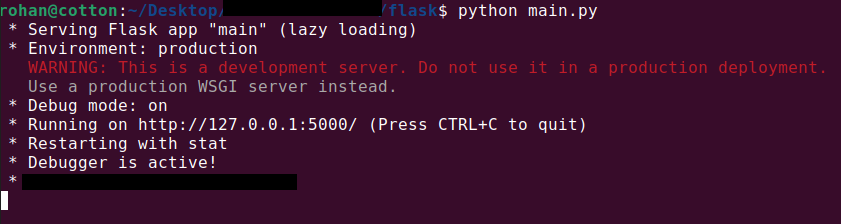
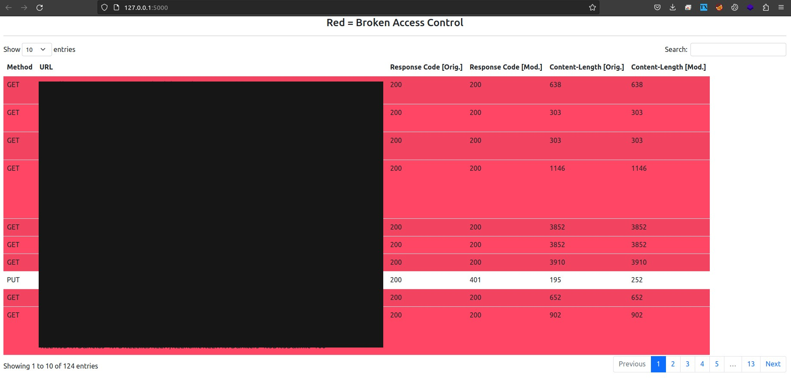

## All Your Shops Are Belong to Us: Security Weaknesses in E-commerce Platforms.

This repository compliments our WWW 2023 submission. It contains the source code of our framework.

## Environment

We recommend to have the following versions installed locally.

* Mitmproxy 8.1.1 
* Python 3.10.4 
* PowerShell 7.2.5

## Instructions 

* Create two merchant accounts for your chosen platform (victim and attacker merchant).
* Clone this repository and enter the **flask** directory.
    ```
    git clone https://github.com/rohanpagey/E-commerce-Security-Analysis-Framework.git && cd flask
    ```

* Modify _config.toml_ as follows:
  - Enter _hostname_ of your target inside _api_host_.
  - Enter the attacker merchant's'session token inside _modified\_session_.

* Run sessionModif.py in background and browse your store as the victim merchant (press Ctrl+C when browsing is done). Replace hostname in the command below before running.
  ```
    mitmdump -s ./sessionModif.py –anticache -w flows/totalflows.flow "~d <hostname>"
    ```
* Generate original and replayed flow files inside the _flows_ directory.
   ```
     mitmdump -nr .\totalflows.flow -w original.flow "!~replay"
     mitmdump -nr .\totalflows.flow -w replayed.flow "~replay"
   ```
 * Run _main.py_ to start the flask server on localhost.
   ```
    python main.py
   ```
   
   
 * Visit the server URL to view results related to Broken Access Control.
 
   
   
## Files

* **sessionModif.py** - Contains the code for modifying session token. This file needs to run in background while you browse as a victim merchant. Stop this file (Ctrl+C) to generate **totalflows.flow**.
* **totalflows.flow** - Contains the HTTP/S requests that was browsed using the victim merchant session and the modified requests by sessionModif.py.
* **original.flow** - This is generated from **totalflows.flow** file and it contains only the browsed traffic.
* **replayed.flow** - This is generated from **totalflows.flow** file and it contains only the replayed traffic.
* **main.py** - This compares the **original.flow** and **replayed.flow** to output the results. This starts a server at localhost:5000 for viewing the results.
